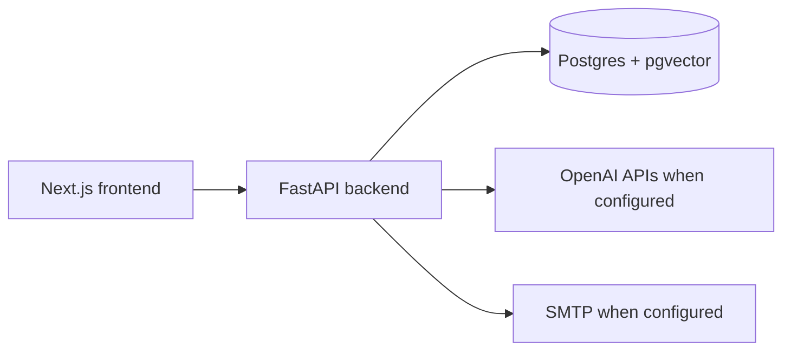

# Architecture

## System shape

The backend owns persistence, threading, search, AI summaries, and outbound
send orchestration. The frontend consumes the backend contracts and renders
inbox, detail, thread history, reply composer, and network graph surfaces.

## Threading boundary

`backend/services/threading_service.py` is the canonical domain service for
assigning persisted `thread_id` values. Parsers extract raw email headers, and
import/API paths persist the service-assigned value. The detailed behavior is
documented in `docs/threading-contract.md`.

## Data and tenancy boundary

Protected backend routes use signed subject-bearing bearer authentication;
deployments must provide `API_AUTH_SIGNING_SECRET` or
`API_AUTH_SIGNING_SECRET_FILE`, and missing authentication configuration fails
closed. Bearer tokens must have a valid HMAC signature, a non-expired `exp`
claim, and a `sub` claim that becomes the authenticated principal. The backend
does not trust request-controlled identity headers.

The `emails` table persists a required `user_id` owner key. Email list,
detail, thread, search, attachment-search, network graph, and reply-count query
paths filter by the authenticated principal from bearer-token authentication;
request-controlled identity headers are ignored. Existing local databases are
backfilled by `backend/scripts/bootstrap_db.py` with the configured
`API_AUTH_USER_ID` (or the local `default` fallback) before the column is made
non-null and indexed. Message IDs are unique per owner via
`(user_id, message_id)`, and fixture upserts use that same composite key so one
principal cannot reassign another principal's imported message.

## Local deployment boundary

`docker-compose.yml` provides the blessed local stack: Postgres with pgvector,
FastAPI backend, and Next.js frontend. The backend bootstrap script creates the
`vector` extension, metadata-defined tables for fresh local databases, and
idempotent threading-column backfills for existing local databases. There is no
Alembic migration history in this repo yet.

## Send boundary

Outbound replies preserve `In-Reply-To` and `References` headers in the built
message payload. Local/dev behavior is explicit: missing SMTP config returns a
400, and simulated send results are marked with `simulated: true` rather than
described as real delivery. `/api/emails/send` rejects blank subject/body values
and applies a database-backed per-authenticated-principal sliding-window rate
limit before SMTP config lookup so horizontal workers share the same 429 guard.
Old send-attempt rows are pruned during enforcement to keep the limiter table
bounded.

## CI security boundary

The Strix workflow treats pull request code as untrusted whenever repository
secrets are available. Privileged PR scans run from `pull_request_target`,
materialize only trusted base content for workflow scripts and dependencies via
the GitHub API, fetch the pull request head as Git objects, and copy changed
PR-head blobs into temporary scan scopes before invoking Strix. Do not checkout
or execute pull request branch scripts in the privileged Strix job.

The gate fails closed when a changed PR-head blob cannot be validated or copied;
it must never fall back to scanning trusted-base content for a modified PR path.
Pull request scans split scoped changed files into small bounded batches before
the timeout-driven rebalance path, so large PRs do not spend the whole required
check budget on one oversized Strix invocation. Strix remains a required
Medium-or-higher gate, while third-party LLM/provider warnings are tracked
separately unless they make the scan incomplete.
Merge-gate governance for Strix, CodeRabbit, and required review evidence is
documented in `docs/development/merge-gate-policy.md`.
