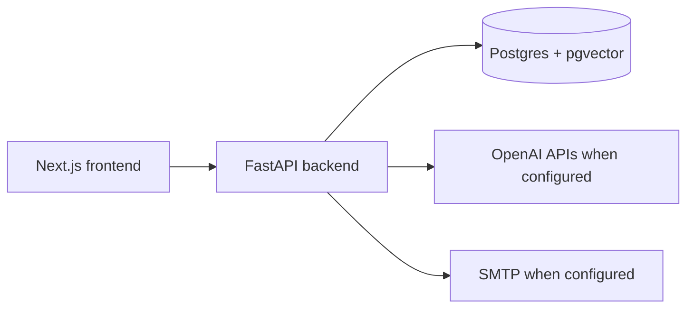

# Architecture

## System shape

The backend owns persistence, threading, search, AI summaries, and outbound
send orchestration. The frontend consumes the backend contracts and renders
inbox, detail, thread history, reply composer, and network graph surfaces.

## Threading boundary

`backend/services/threading_service.py` is the canonical domain service for
assigning persisted `thread_id` values. Parsers extract raw email headers, and
import/API paths persist the service-assigned value. The detailed behavior is
documented in `docs/threading-contract.md`.

## Data and tenancy boundary

Email rows are scoped by `emails.user_id`, and email detail, thread, inbox,
search, network graph, import, and threading lookups filter through the current
authenticated user. Cross-user direct object references return 404 for email
detail and thread routes, which avoids disclosing whether another user's email
ID or thread exists.

The backend requires PyJWT HMAC-signed bearer tokens and derives `current_user`
from the verified token subject instead of trusting client-supplied owner
headers. Tokens include a `jti` identifier that can be denied through the
server-side `revoked_auth_tokens` blocklist table before natural expiration;
`POST /api/auth/revoke` stores the current token ID in that blocklist.
Local development can mint short-lived tokens with `scripts/create_auth_token.py`;
production deployments should replace local token issuance with a verified
identity provider while preserving the same authenticated-user boundary.

Email body content crosses an untrusted ingestion boundary. The parser strips
active HTML before storage, and email/search API responses sanitize again before
returning detail, thread, inbox, or search snippets so legacy raw rows cannot
become a stored-XSS source for clients.

## Local deployment boundary

`docker-compose.yml` provides the blessed local stack: Postgres with pgvector,
FastAPI backend, and Next.js frontend. The backend bootstrap script creates the
`vector` extension, metadata-defined tables for fresh local databases, and
idempotent owner/threading-column backfills for existing local databases. There
is no Alembic migration history in this repo yet.

## Send boundary

Outbound replies preserve `In-Reply-To` and `References` headers in the built
message payload. Local/dev behavior is explicit: missing SMTP config returns a
400, and simulated send results are marked with `simulated: true` rather than
described as real delivery.

Tenant-configured SMTP, IMAP, and POP3 endpoints are validated before storage
and again immediately before outbound use. The shared mail endpoint policy
allows only service-appropriate mail ports (SMTP is limited to 25, 465, and
587) and rejects loopback, private, link-local, unresolved, or otherwise
non-public addresses so tenant settings cannot drive backend workers toward
internal network targets. Outbound send uses the resolver-pinned public address
from validation rather than re-resolving the tenant-controlled hostname.

## CI security boundary

The Strix workflow treats pull request code as untrusted whenever repository
secrets are available. Privileged PR scans run from `pull_request_target`,
materialize only trusted base content for workflow scripts and dependencies via
the GitHub API, fetch the pull request head as Git objects, and copy changed
PR-head blobs into temporary scan scopes before invoking Strix. Do not checkout
or execute pull request branch scripts in the privileged Strix job.

The gate fails closed when a changed PR-head blob cannot be validated or copied;
it must never fall back to scanning trusted-base content for a modified PR path.
Pull request scans split scoped changed files into small bounded batches before
the timeout-driven rebalance path, so large PRs do not spend the whole required
check budget on one oversized Strix invocation. Strix remains a required
Medium-or-higher gate, while third-party LLM/provider warnings are tracked
separately unless they make the scan incomplete.
Merge-gate governance for Strix, CodeRabbit, and required review evidence is
documented in `docs/development/merge-gate-policy.md`.
