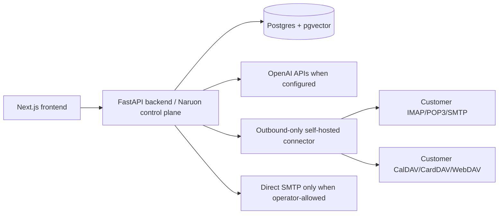

# Architecture

## System shape

The backend owns persistence, threading, search, AI summaries, and outbound
send orchestration. The frontend consumes the backend contracts and renders
inbox, detail, thread history, reply composer, and network graph surfaces.
Runtime database connectivity is secret-injected: `backend/core/config.py` has
no fallback `DATABASE_URL`, so missing database configuration fails at startup
rather than silently using shared development credentials.

## Threading boundary

`backend/services/threading_service.py` is the canonical domain service for
assigning persisted `thread_id` values. Parsers extract raw email headers, and
import/API paths persist the service-assigned value. The detailed behavior is
documented in `docs/threading-contract.md`.

## Data and tenancy boundary

The `emails` table now has nullable `user_id` and `organization_id` owner keys,
and the current email list, detail, thread, search, and network graph endpoints
scope their queries to the authenticated user plus organization. Fresh local
databases get these columns from SQLAlchemy metadata; existing local databases
get them through `scripts/bootstrap_db.py`, which stamps null local rows with
`NARUON_IMPORT_USER_ID` / `NARUON_IMPORT_ORGANIZATION_ID` or `default`. Fixture
imports use the same owner defaults for local data. Production multi-user safety
still requires an audited migration and backfill that maps historical rows to
verified mailbox owners and organizations before real tenant data is mixed in
one database.

`message_id` is unique only within the `(user_id, organization_id)` owner scope,
not globally. Fixture import upserts and reply-thread lookup use the same owner
scope so a reused RFC Message-ID from another organization cannot overwrite an
email row or attach a reply to another tenant's thread.

Customer-owned mail, CalDAV/CardDAV, and WebDAV systems remain the durable
source-of-truth. Naruon can cache/index metadata and generate writeback intents,
but provider writes must use server-authoritative source records, ownership
checks, and conflict-aware provider revisions such as ETag/If-Match. The detailed
contract is documented in
`docs/operations/source-of-truth-and-writeback-sovereignty.md`.

Authorization is RBAC plus ABAC with deny precedence. Data-region, consent,
workspace, group, source capability, and customer-policy denies still override
broad roles. The narrow exception is an explicitly RBAC-permitted
`platform_admin`: that role may cross organization and resource ownership
boundaries in the pure access-policy evaluator for platform operations, but it
does not bypass data-region or consent denies; see
`docs/operations/auth-key-management.md`.

## Local deployment boundary

`docker-compose.yml` provides the blessed local stack: Postgres with pgvector,
FastAPI backend, and Next.js frontend. The backend bootstrap script creates the
`vector` extension, metadata-defined tables for fresh local databases, and
idempotent threading-column backfills for existing local databases. There is no
Alembic migration history in this repo yet.

## Send boundary

Outbound replies preserve `In-Reply-To` and `References` headers in the built
message payload. Local/dev behavior is explicit: missing SMTP config returns a
400, and simulated send results are marked with `simulated: true` rather than
described as real delivery.

Tenant-provided SMTP destinations are not a general outbound socket primitive.
`backend/api/tenant_config.py`, `backend/api/emails.py`, and the final
`backend/services/email_client.py` network sink enforce the operator-controlled
`ALLOWED_SMTP_HOSTS` and `ALLOWED_SMTP_PORTS` allowlists. The service also
rejects loopback, link-local, private, reserved, and otherwise non-global DNS
answers before opening a pinned socket to the selected global address, so stale
database rows or direct service calls fail closed instead of reaching internal
network targets or re-resolving DNS after validation.

Private-network IMAP/SMTP/CalDAV/CardDAV/WebDAV access belongs behind the
outbound-only self-hosted connector boundary. GitHub self-hosted runners can
smoke-test internal mail connectivity, but production relay/proxy access should
use a connector artifact and never imply inbound MX hosting.

## CI security boundary

The Strix workflow treats pull request code as untrusted whenever repository
secrets are available. Privileged PR scans run from `pull_request_target`,
materialize only trusted base content for workflow scripts and dependencies via
the GitHub API, fetch the pull request head as Git objects, and copy changed
PR-head blobs into temporary scan scopes before invoking Strix. When a changed
file is also included as backend context for another batch, the scope still uses
the PR-head blob rather than trusted-base content, so a security fix is not
re-scanned against stale vulnerable context. Do not checkout or execute pull
request branch scripts in the privileged Strix job.

The gate fails closed when a changed PR-head blob cannot be validated or copied;
it must never fall back to scanning trusted-base content for a modified PR path.
Pull request scans split scoped changed files into small bounded batches before
the timeout-driven rebalance path, so large PRs do not spend the whole required
check budget on one oversized Strix invocation. Strix remains a required
Medium-or-higher gate, while third-party LLM/provider warnings are tracked
separately unless they make the scan incomplete.
Merge-gate governance for Strix, CodeRabbit, and required review evidence is
documented in `docs/development/merge-gate-policy.md`.

## Release and operations boundary

Release/deployment architecture is documented in
`docs/operations/release-deployment-architecture.md`. Naruon is not an email
server; the email boundary is a web client relay/proxy for member-configured
SMTP/IMAP providers as documented in
`docs/operations/email-relay-proxy-boundary.md`. PostgreSQL is single-primary in
the current repo and physical replication/WAL restore remain future work per
`docs/operations/postgresql-physical-replication.md`.

Authentication does not treat public `X-User-*`, `X-Organization-*`,
`X-Group-*`, or `X-Dev-Auth-Token` headers as identity material. The runtime
FastAPI dependency in `backend/api/auth.py` accepts only `Authorization: Bearer`
compact session tokens whose protected header pins `alg=HS256` and whose
`header.payload` signing input is signed by the configured
`AUTH_SESSION_HMAC_SECRET`; missing, weak, malformed, legacy two-segment,
wrong-algorithm, tampered, or expired tokens fail closed with 401. The signed
session envelope must carry explicit identity, role, organization/group, and
workspace claims, so user ids such as `admin` do not imply elevated privileges.
Endpoint tests use FastAPI dependency overrides for fixture identity only through
explicit opt-in pytest fixtures, while a full Keycloak/Casdoor/OIDC provider and
audited mailbox-owner migration remain required before production multi-user
access is claimed; see `docs/operations/auth-key-management.md`. The current
Kubernetes ingress assumes NGINX, while Traefik is only an evaluated option in
`docs/operations/traefik-evaluation.md`.

Secret-field encryption has no code fallback key. `backend/db/models.py` requires
an explicit `ENCRYPTION_KEY` before Fernet encrypts or decrypts OAuth, OpenAI,
SMTP, IMAP, Google, and runner registration token fields, even in debug mode.
Routes that touch encrypted values should surface an operator-facing missing-key
error rather than silently storing plaintext or using a shared development key.

Calendar writeback intent selection is server-authoritative. The
`/api/calendar/writeback-intent` request may specify an action and optional
target source id, but it must not provide source ownership or capability records;
`backend/api/calendar.py` obtains writeback sources through a FastAPI dependency
that is empty by default until a connector/source registry supplies trusted
records scoped to the authenticated user.
