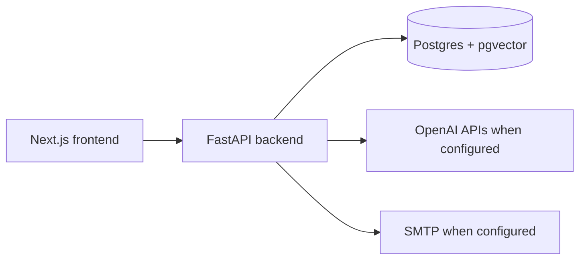

# Architecture

## System shape

The backend owns persistence, threading, search, AI summaries, and outbound
send orchestration. The frontend consumes the backend contracts and renders
inbox, detail, thread history, reply composer, and network graph surfaces.

## Threading boundary

`backend/services/threading_service.py` is the canonical domain service for
assigning persisted `thread_id` values. Parsers extract raw email headers, and
import/API paths persist the service-assigned value. The detailed behavior is
documented in `docs/threading-contract.md`.

## Data and tenancy boundary

The current `emails` table does not have an owner/mailbox key. Email and
search behavior should therefore be treated as single-user local-development
behavior. Multi-user production safety requires a schema migration that adds
mailbox ownership and applies that filter to every email/search query.

## Local deployment boundary

`docker-compose.yml` provides the blessed local stack: Postgres with pgvector,
FastAPI backend, and Next.js frontend. The backend bootstrap script creates the
`vector` extension, metadata-defined tables for fresh local databases, and
idempotent threading-column backfills for existing local databases. There is no
Alembic migration history in this repo yet.

## Send boundary

Outbound replies preserve `In-Reply-To` and `References` headers in the built
message payload. Local/dev behavior is explicit: missing SMTP config returns a
400, and simulated send results are marked with `simulated: true` rather than
described as real delivery.

## CI security boundary

The Strix workflow treats pull request code as untrusted whenever repository
secrets are available. Privileged PR scans run from `pull_request_target`,
checkout only the trusted base commit for workflow scripts and dependencies,
fetch the pull request head as Git objects, and copy changed PR-head blobs into
temporary scan scopes before invoking Strix. Do not checkout or execute pull
request branch scripts in the privileged Strix job.

The gate fails closed when a changed PR-head blob cannot be validated or copied;
it must never fall back to scanning trusted-base content for a modified PR path.
Strix remains a required Medium-or-higher gate, while third-party LLM/provider
warnings are tracked separately unless they make the scan incomplete.
