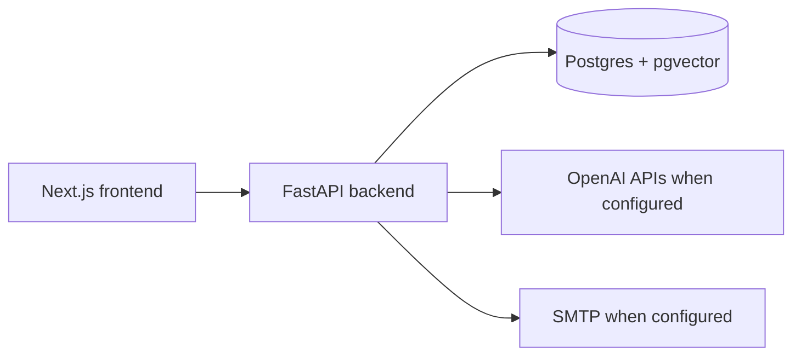

# Architecture

## System shape

The backend owns persistence, threading, search, AI summaries, and outbound
send orchestration. The frontend consumes the backend contracts and renders
inbox, detail, thread history, reply composer, and network graph surfaces.

## Threading boundary

`backend/services/threading_service.py` is the canonical domain service for
assigning persisted `thread_id` values. Parsers extract raw email headers, and
import/API paths persist the service-assigned value. The detailed behavior is
documented in `docs/threading-contract.md`.

## Data and tenancy boundary

The `emails` table now has a nullable `user_id` owner key, and the current
email list, detail, thread, search, and network graph endpoints scope their
queries to the authenticated user. Fresh local databases get this column from
SQLAlchemy metadata; existing local databases get it through
`scripts/bootstrap_db.py`, which stamps null local rows with
`NARUON_IMPORT_USER_ID` or `default`. Fixture imports use the same owner default
for local data. Production multi-user safety still requires an audited migration
and backfill that maps historical rows to verified mailbox owners before real
tenant data is mixed in one database.

## Local deployment boundary

`docker-compose.yml` provides the blessed local stack: Postgres with pgvector,
FastAPI backend, and Next.js frontend. The backend bootstrap script creates the
`vector` extension, metadata-defined tables for fresh local databases, and
idempotent threading-column backfills for existing local databases. There is no
Alembic migration history in this repo yet.

## Send boundary

Outbound replies preserve `In-Reply-To` and `References` headers in the built
message payload. Local/dev behavior is explicit: missing SMTP config returns a
400, and simulated send results are marked with `simulated: true` rather than
described as real delivery.

## CI security boundary

The Strix workflow treats pull request code as untrusted whenever repository
secrets are available. Privileged PR scans run from `pull_request_target`,
materialize only trusted base content for workflow scripts and dependencies via
the GitHub API, fetch the pull request head as Git objects, and copy changed
PR-head blobs into temporary scan scopes before invoking Strix. When a changed
file is also included as backend context for another batch, the scope still uses
the PR-head blob rather than trusted-base content, so a security fix is not
re-scanned against stale vulnerable context. Do not checkout or execute pull
request branch scripts in the privileged Strix job.

The gate fails closed when a changed PR-head blob cannot be validated or copied;
it must never fall back to scanning trusted-base content for a modified PR path.
Pull request scans split scoped changed files into small bounded batches before
the timeout-driven rebalance path, so large PRs do not spend the whole required
check budget on one oversized Strix invocation. Strix remains a required
Medium-or-higher gate, while third-party LLM/provider warnings are tracked
separately unless they make the scan incomplete.
Merge-gate governance for Strix, CodeRabbit, and required review evidence is
documented in `docs/development/merge-gate-policy.md`.

## Release and operations boundary

Release/deployment architecture is documented in
`docs/operations/release-deployment-architecture.md`. Naruon is not an email
server; the email boundary is a web client relay/proxy for member-configured
SMTP/IMAP providers as documented in
`docs/operations/email-relay-proxy-boundary.md`. PostgreSQL is single-primary in
the current repo and physical replication/WAL restore remain future work per
`docs/operations/postgresql-physical-replication.md`.

Authentication does not treat public `X-User-*`, `X-Organization-*`,
`X-Group-*`, or `X-Dev-Auth-Token` headers as identity material. The runtime
FastAPI dependency in `backend/api/auth.py` accepts only `Authorization: Bearer`
session tokens signed by the configured `AUTH_SESSION_HMAC_SECRET`; missing,
weak, malformed, tampered, or expired tokens fail closed with 401. The signed
session envelope must carry explicit identity, role, organization/group, and
workspace claims, so user ids such as `admin` do not imply elevated privileges.
Endpoint tests use FastAPI dependency overrides for fixture identity only through
explicit opt-in pytest fixtures, while a full Keycloak/Casdoor/OIDC provider and
audited mailbox-owner migration remain required before production multi-user
access is claimed; see `docs/operations/auth-key-management.md`. The current
Kubernetes ingress assumes NGINX, while Traefik is only an evaluated option in
`docs/operations/traefik-evaluation.md`.

Secret-field encryption has no code fallback key. `backend/db/models.py` requires
an explicit `ENCRYPTION_KEY` before Fernet encrypts or decrypts OAuth, OpenAI,
SMTP, IMAP, Google, and runner registration token fields, even in debug mode.
Routes that touch encrypted values should surface an operator-facing missing-key
error rather than silently storing plaintext or using a shared development key.

Calendar writeback intent selection is server-authoritative. The
`/api/calendar/writeback-intent` request may specify an action and optional
target source id, but it must not provide source ownership or capability records;
`backend/api/calendar.py` obtains writeback sources through a FastAPI dependency
that is empty by default until a connector/source registry supplies trusted
records scoped to the authenticated user.
