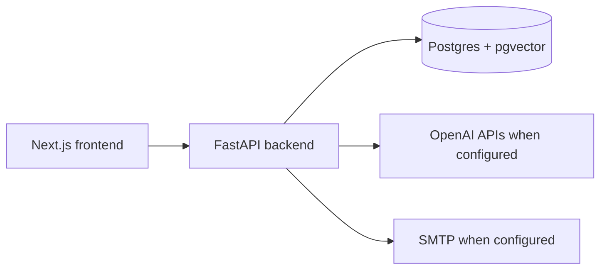

# Architecture

## System shape

The backend owns persistence, threading, search, AI summaries, and outbound
send orchestration. The frontend consumes the backend contracts and renders
inbox, detail, thread history, reply composer, and network graph surfaces.

The current frontend shell is organized around three operator-facing work
surfaces: inbox triage, detail/conversation review, and a context/judgment/
execution rail. Desktop now exposes board-style summary cards above the main
workspace, while mobile uses a five-item bottom navigation (`받은 메일`, `맥락
종합`, `판단 포인트`, `실행 항목`, `설정`) and swipe gestures to push email
threads into a persisted per-user `ExecutionItem` queue. The frontend still
keeps a user-scoped local cache for rendering/subscription, but queue creation
and completion now flow through `/api/execution-items`.

## Threading boundary

`backend/services/threading_service.py` is the canonical domain service for
assigning persisted `thread_id` values. Parsers extract raw email headers, and
import/API paths persist the service-assigned value. The detailed behavior is
documented in `docs/threading-contract.md`.

## Data and tenancy boundary

The current `emails` table now has a minimal owner field (`Email.user_id`) and
the inbox/detail/thread read paths already filter on it. That closes the most
obvious single-user leakage, but it is still only a bridge. Multi-user
production safety still requires a real `Mailbox` aggregate with provider/source
identity plus mailbox/member/org scoped filtering for email, search, network,
attachments, and synthetic routing.

`MailboxAccount` is now the first mailbox-configuration aggregate: multiple
accounts per user, one default reply account, and explicit SMTP/IMAP credentials
separate from the legacy `TenantConfig` singleton. Compose/send flows can now
target a linked mailbox account, but stored emails still need a future
`mailbox_account_id` rollout across every real sync/import path before reply
routing becomes fully automatic for all stored messages. Fixture/ZIP imports now
attempt that routing, and the IMAP worker now enumerates active `MailboxAccount`
rows instead of the legacy singleton config, but real persisted IMAP/POP/OAuth
sync paths are still pending. The inbox
API and UI are now mailbox-aware as well: list items carry `mailbox_account_id`,
the inbox can filter by a linked mailbox account, and rows show their source
account label. Search now follows that same scope and keeps mailbox provenance in
its result items so the UI does not lose account context when a user searches.
During the bridge period, mailbox-filtered thread and search paths include
legacy `mailbox_account_id IS NULL` rows for the authenticated owner so restored
thread context is not lost before the mailbox migration is complete; the inbox UI
labels those bridge rows as `이전 복원 메일` when a mailbox filter is active.
Bootstrap now fails closed if ownerless legacy email rows remain and
`LEGACY_EMAIL_OWNER_USER_ID` is not set, preventing a silent deployment where
existing inbox/search/network data disappears behind the new owner filters.

`MailboxAccount` also now carries POP3 credentials and the background worker
enumerates active POP3 accounts from that aggregate with bounded socket timeouts,
and the app lifecycle now starts/stops that worker beside IMAP. Mailbox-account
create/update also normalizes mailbox strings, blocks internal-network mail
server hosts and non-mail ports, enforces server/port pair invariants, forces
default-reply accounts active, and returns stable 409/503 errors for duplicate
account or missing encryption-key failures. This is still only a
connection/scheduling foundation, not a persisted message ingestion path.

## Local deployment boundary

`docker-compose.yml` provides the blessed local stack: Postgres with pgvector,
FastAPI backend, and Next.js frontend. The backend bootstrap script creates the
`vector` extension, metadata-defined tables for fresh local databases, and
idempotent threading-column backfills for existing local databases. There is no
Alembic migration history in this repo yet.

## Send boundary

Outbound replies preserve `In-Reply-To` and `References` headers in the built
message payload. Local/dev behavior is explicit: missing SMTP config returns a
400, and simulated send results are marked with `simulated: true` rather than
described as real delivery.

## CI security boundary

The Strix workflow treats pull request code as untrusted whenever repository
secrets are available. Privileged PR scans run from `pull_request_target`,
materialize only trusted base content for workflow scripts and dependencies via
the GitHub API, fetch the pull request head as Git objects, and copy changed
PR-head blobs into temporary scan scopes before invoking Strix. Do not checkout
or execute pull request branch scripts in the privileged Strix job.

The gate fails closed when a changed PR-head blob cannot be validated or copied;
it must never fall back to scanning trusted-base content for a modified PR path.
Pull request scans split scoped changed files into small bounded batches before
the timeout-driven rebalance path, so large PRs do not spend the whole required
check budget on one oversized Strix invocation. Strix remains a required
Medium-or-higher gate, while third-party LLM/provider warnings are tracked
separately unless they make the scan incomplete.
Merge-gate governance for Strix, CodeRabbit, and required review evidence is
documented in `docs/development/merge-gate-policy.md`.

## Release and operations boundary

Release/deployment architecture is documented in
`docs/operations/release-deployment-architecture.md`. Naruon is not an email
server; the email boundary is a web client relay/proxy for member-configured
SMTP/IMAP providers as documented in
`docs/operations/email-relay-proxy-boundary.md`. PostgreSQL is single-primary in
the current repo and physical replication/WAL restore remain future work per
`docs/operations/postgresql-physical-replication.md`.

Authentication now supports three backend modes: `header`, `hybrid`, and
`oidc`, with `hybrid` as the fail-closed default. Trusted header auth only runs
when `DEBUG=true` or `TRUST_DEV_HEADERS=true`; the raw backend default and the
repo-local dev/live-E2E Compose defaults remain fail-closed. Local developer or
live-E2E trusted-header runs must opt in explicitly with `AUTH_MODE=header` and
`TRUST_DEV_HEADERS=true`, and the provided Compose port bindings stay loopback
only (`127.0.0.1`) so that escape hatch is not advertised as a production
posture.

In `oidc`/`hybrid`, bearer tokens are normalized into the shared
`AuthContext` with `platform_admin`, `organization_admin`, `group_admin`, and
`member` roles plus optional organization/group scope. The backend currently
accepts HS256 shared-secret tokens and RS256 bearer tokens validated against a
configured JWKS URL, which is enough for staged Keycloak/Casdoor integration.

The frontend only exposes the dev identity shim on loopback hosts (`localhost`,
`127.0.0.1`) when no bearer token is present and `/api/runtime-config` confirms
trusted-header auth is enabled; local storage alone cannot mint trusted headers
or admin workspace affordances. Admin settings and Prompt Studio controls are
claim-gated in the UI before the backend performs its own authorization checks.
Runner tokens are organization-scoped, while LLM provider access is now
org-scoped through `organization_id`. Shared prompt templates require both
organization scope and a workspace-admin role (`platform_admin` or
`organization_admin`), while user-owned private prompts remain visible to their
creator. Provider-backed prompt testing is also workspace-admin-only because it
uses the organization's configured LLM provider. Legacy provider rows require an
explicit bootstrap migration mapping (`LEGACY_LLM_PROVIDER_ORGANIZATION_ID`)
before they reappear in the new org scoped APIs. See
`docs/operations/auth-key-management.md`. The current
Kubernetes ingress assumes NGINX, while Traefik is only an evaluated option in
`docs/operations/traefik-evaluation.md`.

`ExecutionItem` is now a persisted personal queue fed from email swipe/actions.
It is intentionally self-owned (`user_id`) and currently uses a temporary
mailbox ownership check through `Email.user_id`, and list/detail/thread reads in
`/api/emails` now use that same owner field. This is the first real object-scope
boundary, but it is still only a per-user ownership column, not yet a full
`Mailbox` aggregate with account/provider/source provenance.

Execution items now also preserve source mailbox context and an excerpt from the
source email (`source_mailbox_account_id`, `source_snippet`) so the action board
can keep account provenance visible after the email leaves the inbox view.

Calendar sync is authenticated but intentionally has no body-token trust path:
`/api/calendar/sync` ignores any submitted `user_token` and returns 503 until a
server-side per-user calendar credential store is implemented. That keeps the UI
action honest without turning app identity claims into Google OAuth credentials.
