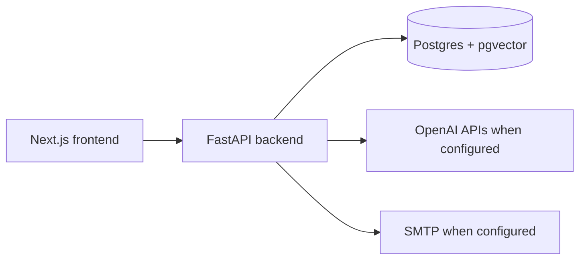

# Architecture

## System shape

The backend owns persistence, threading, search, AI summaries, and outbound
send orchestration. The frontend consumes the backend contracts and renders
inbox, detail, thread history, reply composer, and network graph surfaces.

## Threading boundary

`backend/services/threading_service.py` is the canonical domain service for
assigning persisted `thread_id` values. Parsers extract raw email headers, and
import/API paths persist the service-assigned value. The detailed behavior is
documented in `docs/threading-contract.md`.

## Data and tenancy boundary

The current `emails` table does not have an owner/mailbox key. Email and
search behavior should therefore be treated as single-user local-development
behavior. Multi-user production safety requires a schema migration that adds
mailbox ownership and applies that filter to every email/search query.
External email text, headers, JSON payloads, and LLM outputs must remove or
replace NUL bytes (`\u0000`/`\x00`) before PostgreSQL persistence because the
database cannot store NUL characters in text/json fields.

## Local deployment boundary

`docker-compose.yml` provides the blessed local stack: Postgres with pgvector,
FastAPI backend, and Next.js frontend. The backend bootstrap script creates the
`vector` extension, metadata-defined tables for fresh local databases, and
idempotent threading-column backfills for existing local databases. There is no
Alembic migration history in this repo yet.

## Send boundary

Outbound replies preserve `In-Reply-To` and `References` headers in the built
message payload. Local/dev behavior is explicit: missing SMTP config returns a
400, and simulated send results are marked with `simulated: true` rather than
described as real delivery.

## CI security boundary

The Strix workflow treats pull request code as untrusted whenever repository
secrets are available. Privileged PR scans run from `pull_request_target`,
materialize only trusted base content for workflow scripts and dependencies via
the GitHub API, fetch the pull request head as Git objects, and copy changed
PR-head blobs into temporary scan scopes before invoking Strix. Do not checkout
or execute pull request branch scripts in the privileged Strix job.

The gate fails closed when a changed PR-head blob cannot be validated or copied;
it must never fall back to scanning trusted-base content for a modified PR path.
Pull request scans split scoped changed files into small bounded batches before
the timeout-driven rebalance path, so large PRs do not spend the whole required
check budget on one oversized Strix invocation. Strix remains a required
Medium-or-higher gate, while third-party LLM/provider warnings are tracked
separately unless they make the scan incomplete.
Merge-gate governance for Strix, CodeRabbit, and required review evidence is
documented in `docs/development/merge-gate-policy.md`.

## Release and packaging boundary

Application CI, Bandit, Docker image validation, PR governance, and Strix form
the release gate. Release images are split into `ai_email_client-backend` and
`ai_email_client-frontend` GHCR packages and must use SemVer tags such as
`0.1.0`; `latest` alone is not release evidence.

The FastAPI API process is stateless for scaling. IMAP synchronization runs as a
separate worker process or deployment so increasing API replicas does not start
duplicate mailbox sync loops.

## Observability boundary

The default open-source APM stack is Prometheus, Grafana, Loki, Tempo, and the
OpenTelemetry Collector. `/healthz` reports process liveness, `/readyz` checks
database readiness, and `/metrics` exposes Prometheus text metrics.

## Mail network boundary

Naruon is not an email server. It connects outbound to external SMTP/IMAP
providers configured by tenants. Internal-only mail smoke tests use a protected
self-hosted GitHub runner with the `mail-egress` label and do not open inbound
SMTP/MX paths.

## PostgreSQL replication boundary

Local Compose is single-node development storage. Production physical replication
should default to managed PostgreSQL read replicas. Self-hosted AKS PostgreSQL
requires PVCs, backup/restore drills, pgvector compatibility checks, and replica
lag monitoring before it can be called release-ready.

## Edge auth and gateway boundary

Current auth remains a development boundary until mailbox ownership is modeled in
the database. Production auth should evaluate Keycloak or Casdoor as the OIDC
provider and Traefik as the edge gateway for TLS, routing, rate limits, security
headers, and forward-auth or `auth_request` style integration. The API must only
trust verified identity and tenant claims from that boundary, then enforce tenant
filters in every email/search/write query. The operational checklist lives in
`docs/operations/edge-auth.md`.
