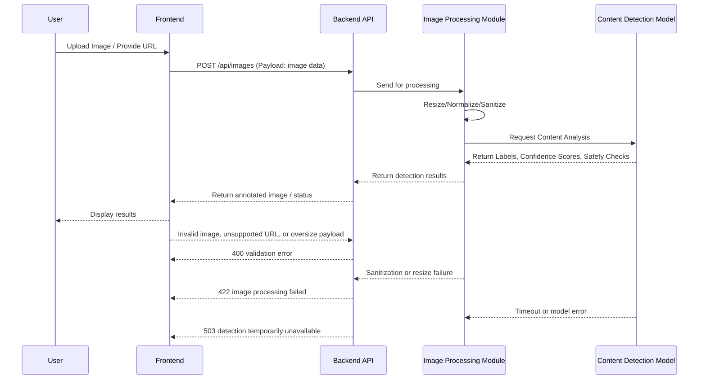

# Image-Content Detection Flow

This document outlines the architecture and flow for processing and detecting image contents within the Naruon workspace.

## Flow Diagram

## Processing Steps

1. **Ingestion:** Images are uploaded via the frontend or fetched through URLs (e.g., email attachments).
2. **Sanitization:** The image is stripped of EXIF data and malicious payloads to prevent security risks.
3. **Normalization:** The image is resized and converted to a standard format (e.g., JPEG or WebP) to ensure consistent model input.
4. **Detection:** The image is sent to an open-source detection model.
5. **Classification:** The model returns labels (e.g., categories, text OCR) and safety scores.
6. **Action:** Based on the results, the content is either indexed for search, flagged for review, or rejected.

## Failure Modes and Recovery

* **POST /api/images validation:** Reject unsupported MIME types, unsafe URLs, and oversized payloads before storage or model work, then return a deterministic 400 response.
* **Image Processing Module:** Treat sanitization, decoding, and resize failures as non-retryable user-input errors. Log the failure with request provenance, but do not persist unsafe transformed images.
* **Content Detection Model:** Apply bounded retries for transient model timeouts and return a 503 response when the detector is unavailable. Keep the original source item queued for later analysis instead of claiming a completed detection result.
* **Monitoring:** Emit structured processing, retry, and failure counters so operators can distinguish invalid input from detector capacity or model health issues.

## Open-Source Image Detection Model Choices & Limitations

Currently, Naruon leverages open-source vision models to ensure privacy and control.

*   **Models:** We utilize models like LLaVA or similar open-weights vision-language models depending on the environment context (hosted via Ollama when applicable).
*   **Why Open Source:**
    *   Data Privacy: User email attachments and images never leave the controlled network environment unless explicitly permitted.
    *   Customization: We can fine-tune or swap models based on specific detection needs (e.g., document OCR vs. general object detection).
*   **Limitations:**
    *   **Resource Intensive:** Running large vision models requires significant GPU/CPU resources, which might limit throughput on smaller deployments.
    *   **Hallucination/Accuracy:** While powerful, open-source models may sometimes hallucinate details or struggle with highly complex visual scenes or tiny text compared to massive proprietary APIs.
    *   **Latency:** Processing time might be longer than managed cloud APIs.

## Verification and Testing

Our CI pipeline includes testing for the image processing flow, using synthetic test images to verify the sanitization, scaling, and classification logic. Model regressions are caught using static assertion checks against known image sets.
