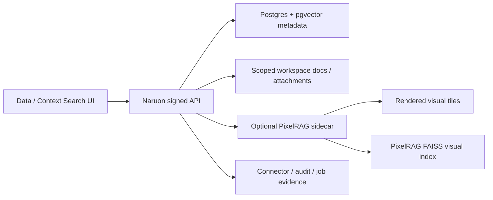

# RFC: PixelRAG Integration Evaluation

**Status:** Proposed
**Date:** 2026-06-22
**Repository baseline:** `upstream/develop` at `98317a1d23cb622bde60aad145b986878c265bd2`
**External candidate:** [StarTrail-org/PixelRAG](https://github.com/StarTrail-org/PixelRAG)

## Summary

Do not add PixelRAG as a core Naruon dependency yet.

Evaluate it as an optional, customer-controlled visual retrieval sidecar for the
Data and Context Search workspaces. The first implementation, if approved,
should be a thin spike that indexes a small set of scoped workspace documents or
email attachments into a separate PixelRAG index and returns visual tile
evidence through a signed Naruon API. Naruon must keep PostgreSQL/pgvector as
the default metadata and text-search store, and must not call the public hosted
PixelRAG API with tenant documents.

## Why This Is Being Considered

Naruon already handles email, attachment, task, calendar, WebDAV, Data, Search,
and AI Hub surfaces as a control plane over customer-owned systems. The current
RAG/search path is text and metadata first. PixelRAG is interesting because it
retrieves over rendered screenshot tiles, which can preserve tables, charts,
diagrams, layout, and other visual structure that text extraction can lose.

This is relevant for:

- PDF proposals and reports attached to mail threads.
- Slide decks and screenshots where spatial layout matters.
- Data workspace quality review when OCR/text extraction is incomplete.
- Context Search answers that need visual evidence rather than only text chunks.

## Evidence Snapshot

### Naruon Baseline

- `ARCHITECTURE.md` defines Naruon as FastAPI + Next.js + PostgreSQL/pgvector,
  with an outbound-only self-hosted connector for customer network protocols.
- Customer-owned mail, CalDAV/CardDAV, and WebDAV systems remain the durable
  source of truth. Naruon may cache/index metadata and generate writeback
  intents, but writes must remain server-authoritative and conflict-aware.
- The Data workspace uses signed `/api/data/quality-surface` evidence and
  signed workspace document endpoints. Reparse, embedding regeneration, HWP
  conversion, and WebDAV materialization are scoped control-plane actions.
- AI Hub is source-backed through signed prompt/provider/audit evidence and must
  not reintroduce static model-score or fake workflow fixtures.

### PixelRAG Baseline

Verified on 2026-06-22:

- Repository: `StarTrail-org/PixelRAG`
- License: Apache-2.0
- Latest checked commit: `22b46d648d3a31740471ba513fe72f636cf64ccc`
- Latest checked CI run: success on 2026-06-22
- Package version: `pixelrag==0.2.1`
- Python requirement: `>=3.12`
- Core command: `pixelshot` renders pages/documents into screenshot tiles.
- Optional pipeline commands: `pixelrag chunk`, `pixelrag embed`,
  `pixelrag build-index`, `pixelrag index`, and `pixelrag serve`.
- Optional heavy dependencies include Torch, Transformers, FAISS, and
  Qwen-VL utilities.
- Hosted PixelRAG API advertises a prebuilt Wikipedia index; a live status check
  reported a 2048-dimensional index of 26,315,959 vectors and about 216 GB.

Sources:

- [PixelRAG README](https://github.com/StarTrail-org/PixelRAG/blob/main/README.md)
- [PixelRAG pyproject.toml](https://github.com/StarTrail-org/PixelRAG/blob/main/pyproject.toml)
- [PixelRAG CI workflow](https://github.com/StarTrail-org/PixelRAG/actions/workflows/ci.yml)
- [PixelRAG API status](https://api.pixelrag.ai/status)

## Decision Drivers

- Preserve Naruon's customer-owned source-of-truth boundary.
- Avoid sending tenant documents to third-party hosted indexes by default.
- Keep RBAC/ABAC, workspace scope, and source capability checks in Naruon.
- Avoid adding Torch/FAISS/Qwen runtime weight to the main backend image.
- Keep existing Data/Search/AI Hub surfaces source-backed and honest about
  pending provider execution.
- Support visual evidence only where text extraction has a real product gap.

## Considered Options

### Option 1: Do Nothing

Keep current text/metadata RAG and document PixelRAG as out of scope.

**Pros**

- No runtime, security, or operational change.
- No new dependency or model lifecycle.

**Cons**

- Does not address visually rich PDFs, charts, tables, slide decks, or
  screenshots.
- Leaves Data quality users without a clear path when OCR/text extraction loses
  visual evidence.

### Option 2: Add PixelRAG Directly to the Backend

Install `pixelrag[index]` or `pixelrag[serve]` in the FastAPI backend image and
call it from existing Data/Search APIs.

**Pros**

- Simple application call path.
- Fewer network hops than a sidecar.

**Cons**

- Pulls heavy optional dependencies into the main backend.
- Couples Naruon backend deployment to FAISS/Torch/model/runtime issues.
- Makes GPU/MPS/CPU placement harder to manage.
- Increases blast radius for a feature that is still unproven for Naruon users.

**Decision:** Reject for now.

### Option 3: Use the Public Hosted PixelRAG API

Call `https://api.pixelrag.ai/search` from Naruon.

**Pros**

- Fastest prototype for public Wikipedia queries.
- No local index management.

**Cons**

- Not tenant-safe for customer documents.
- Hosted index is not Naruon's customer-owned data.
- Does not satisfy Naruon's source-backed Data/Search evidence boundary.

**Decision:** Reject for tenant data. It may be used only for manual public-data
research outside product runtime.

### Option 4: Optional PixelRAG Sidecar

Run PixelRAG render/index/serve outside the main backend. Naruon sends only
server-authorized, scoped document jobs to the sidecar and stores only safe
metadata, source ids, and visual tile references.

**Pros**

- Keeps main backend small.
- Isolates Torch/FAISS/model/GPU dependencies.
- Matches connector/source-backed architecture better than direct embedding.
- Lets operators disable the feature per workspace or deployment.

**Cons**

- Requires a new service contract and lifecycle checks.
- Requires clear retention and deletion behavior for rendered tiles.
- Needs additional observability before production use.

**Decision:** Preferred investigation path.

### Option 5: PixelRAG Inside the Self-Hosted Connector

Run rendering and indexing in the customer's network through the outbound
connector.

**Pros**

- Strongest data-sovereignty story for private documents.
- Avoids sending raw visual tiles to Naruon-managed infrastructure unless policy
  allows it.

**Cons**

- Connector is already responsible for provider protocol execution.
- GPU/model/runtime requirements may make customer connector deployment too
  heavy.
- More support burden than a control-plane sidecar.

**Decision:** Keep as a later enterprise option, not the first spike.

## Proposed Architecture

Rules:

- Naruon remains the policy decision point.
- PixelRAG sidecar is a worker/search service, not a source of truth.
- Naruon must pass opaque document/source ids, not browser-supplied paths,
  credentials, usernames, provider URLs, or raw tenant identity claims.
- Sidecar output must be scoped by organization, workspace, user, and document
  source.
- UI results must show visual evidence as evidence, not completed provider
  writes.
- Deletion or reparse must invalidate stale visual tiles and index rows.

## Minimal Spike Scope

One PR after this RFC is accepted:

1. Add a feature flag such as `PIXELRAG_SIDECAR_BASE_URL`.
2. Add a tiny backend client with HTTPS allowlist validation using the existing
   outbound URL validation posture.
3. Add a signed admin-only readiness endpoint that reports sidecar availability.
4. Add an intent-only job request for one scoped workspace document or
   attachment.
5. Store only job metadata and source evidence; do not store tile images in
   PostgreSQL.
6. Render Data UI pending/ready/error states from signed API evidence.
7. Add one mocked backend test and one frontend test proving bearer-session use
   and no public identity headers.

Do not add PixelRAG Python dependencies to `backend/requirements.txt` in that
spike.

## User Stories

### Administrator

As a workspace administrator, I want to enable visual document retrieval only for
approved workspaces, so tenant documents are not rendered or indexed without
explicit policy.

Acceptance criteria:

- The feature is disabled unless an operator configures the sidecar.
- Organization admins can see whether visual retrieval is unavailable,
  configured, healthy, or degraded.
- HMAC-only platform admin claims cannot bypass workspace membership checks for
  visual index access.

### Knowledge Worker

As a user searching a thread or project, I want search results to include the
actual page/tile where a chart, table, or diagram appears, so I can verify the
answer visually.

Acceptance criteria:

- Results show the source email/thread/document context.
- Results show a visual evidence preview only if the signed session can access
  that source.
- If visual retrieval is unavailable, text search still works and the UI labels
  visual search as unavailable rather than empty.

### Data Steward

As a data steward, I want to find documents whose text extraction misses visual
content, so I can prioritize reparse or visual indexing work.

Acceptance criteria:

- Data quality distinguishes text extraction coverage from visual tile coverage.
- Visual indexing jobs are scoped to organization/workspace and source document.
- Failed jobs show deterministic error codes such as `sidecar_unavailable`,
  `render_failed`, or `index_failed`.

### Security Administrator

As a security administrator, I want visual tiles and indexes to follow the same
data-region, consent, and retention policies as their source documents, so the
visual index does not become a shadow data store.

Acceptance criteria:

- Visual index rows inherit source document access policy.
- Visual tiles are not exposed through public URLs.
- Audit events record actor, workspace, source id, action, and outcome without
  logging document content, credentials, or provider URLs.

### Operator

As an operator, I want PixelRAG runtime health and capacity isolated from the
main backend, so Torch/FAISS/model failures do not take down Naruon mail and
task workflows.

Acceptance criteria:

- Backend starts without PixelRAG installed.
- Sidecar failures are reported as unavailable/degraded state.
- The main backend image size and dependency graph do not change in the first
  spike.

### Developer

As a developer, I want a narrow sidecar contract before any UI promise is made,
so future implementation does not copy static demo fixtures into Data or Search.

Acceptance criteria:

- API tests prove signed-session scoping.
- Frontend tests prove bearer token calls and no public `X-User-*` headers.
- The implementation docs name the exact non-goals: no public hosted API for
  tenant data, no core backend dependency, no provider writeback.

## Risks and Mitigations

| Risk | Impact | Mitigation |
| --- | --- | --- |
| Heavy ML dependencies enter the backend | Larger image, slower CI, more CVE surface | Sidecar only; no backend dependency in spike |
| Visual tiles become shadow customer data | Compliance and retention risk | Treat tiles/index rows as derived tenant data with source policy and deletion |
| Public hosted API receives tenant documents | Data leakage | Disallow hosted API for product runtime tenant data |
| Index size grows quickly | Storage/cost risk | Start with small workspace-document spike and explicit retention |
| Visual retrieval answers lack text provenance | Trust risk | Always return source email/thread/document plus tile evidence |
| Sidecar unavailable | User confusion | Keep text search path and explicit unavailable state |

## Non-Goals

- No production PixelRAG implementation in this RFC PR.
- No direct dependency addition to `backend/requirements.txt`.
- No hosted PixelRAG API calls with tenant data.
- No replacement of PostgreSQL/pgvector text/metadata search.
- No connector or provider writeback behavior change.
- No UI claim that visual retrieval is implemented before signed source-backed
  APIs exist.

## Recommendation

Accept the investigation direction but defer implementation.

The next practical step is a narrow sidecar spike for one workspace document or
attachment path. The spike should prove source scoping, deletion/retention
semantics, and visual evidence rendering before Naruon commits to productizing
PixelRAG.

If the spike cannot prove tenant-safe scoping and manageable runtime cost, keep
PixelRAG as a referenced research option only.
