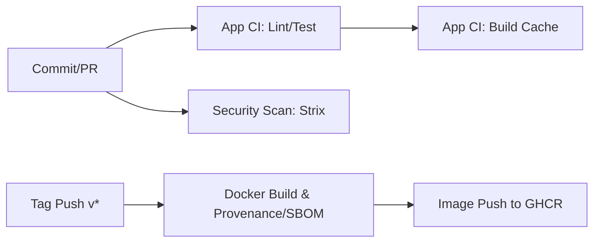

# Cloud-Native Deployability Assessment

## 1. Executive Summary

현재 Naruon 저장소는 로컬 및 Docker Compose 기반 실행 경로는 일부 제공하고 있으나,
EKS, GKE, AKS와 같은 관리형 Kubernetes 환경에 대한 참조 배포 예제는 충분하지 않다.

특히 Kubernetes Manifest, GitHub Actions Image Publish Workflow, Registry/Tag 전략 간 정합성 검증이 필요하다.

Manifest가 참조하는 Image Tag(`latest`)와 CI/CD가 실제 Push하는 Image Tag(`v*` 버전 태그)가 불일치할 경우,
실제 클러스터 접근 없이도 ImagePullBackOff 가능성을 구조적 위험으로 판단할 수 있다.

따라서 본 저장소는 특정 CSP 장애 사례가 아니라,
Cloud-Native Application으로서의 Deployability, Operability, Security, Supply Chain Readiness를 전반적으로 보완해야 한다.

본 평가는 실제 EKS/GKE/AKS 배포 검증이 아니다. 클라우드 계정 및 클러스터 접근 없이 수행한 정적 배포 가능성 평가이다.

## 2. Repository Execution Path

| 구분 | 확인 내용 |
|--------|--------|
| Local | Python(FastAPI) 및 Node.js(Next.js) 기반 로컬 실행 명령 지원 (`scripts/start_backend.py`, `npm run start`). (지원됨) |
| Docker | `Dockerfile` 및 `frontend/Dockerfile` 을 통해 Multi-stage 빌드 지원. (지원됨) |
| Compose | `docker-compose.yml`, `docker-compose.live-e2e.yml` 등 목적별 Compose 파일 다수 제공 (`scripts/naruon_compose.sh` 래퍼 존재). (지원됨) |
| Kubernetes | `k8s/` 디렉터리에 기초적인 Deployment, Service, Ingress, StatefulSet 매니페스트 존재. (부분 지원) |
| Cloud Kubernetes | EKS/GKE/AKS별 전용 참조 예제 부재. (미지원) |

## 3. Kubernetes Manifest Assessment

`k8s/` 디렉터리 내 매니페스트 평가 결과:

| 항목 | 점검 내용 |
|--------|--------|
| Namespace | 별도 namespace 정의 여부: **없음** |
| Deployment | replicas(1), selector, template 일관성: **존재** |
| Service | port, targetPort, type 적정성: **존재** (기본 ClusterIP 타입) |
| Ingress/Gateway | 외부 접근 경로 정의 여부: **존재** (nginx-ingress 기반) |
| ConfigMap | 환경 설정 분리 여부: **없음** (Deployment의 env 필드에 직접 정의 또는 Secret 참조) |
| Secret | 민감정보 분리 여부: **부분 지원** (SecretKeyRef 사용하나 Secret 매니페스트 자체는 부재) |
| PVC | 상태 저장 데이터 처리 여부: **없음** (StatefulSet 존재하나 volumeClaimTemplates 부재하여 재시작시 데이터 유실) |
| HPA | 자동 확장 기준 존재 여부: **없음** |
| PDB | 장애 및 업데이트 중 최소 가용성 보장 여부: **없음** |
| NetworkPolicy | Pod 간 통신 제한 여부: **없음** |
| Probe | readiness/liveness/startup probe 존재 여부: **없음** |
| Resources | CPU/Memory requests/limits 설정 여부: **없음** |
| SecurityContext | root 실행 여부, privilege escalation 제한 여부: **없음** (기본 권한 실행) |
| ImagePullPolicy | 태그 전략과 일관성 여부: **Always** (latest 태그와 결합 시 위험) |

## 4. Image Tagging and Registry Strategy

| 항목 | 확인 내용 |
|--------|--------|
| Registry | GHCR (`ghcr.io`) 전제 |
| Image Tag | Manifest는 `latest` 사용. Workflow는 `semver (v*)` 사용. **(불일치)** |
| Push 조건 | `v*` 태그 푸시 시 `docker-publish.yml`에서 빌드 및 푸시 |
| Pull 조건 | Manifest(`k8s/*.yaml`)가 참조하는 `latest` 태그는 CI/CD에서 Push되지 않음 |
| Immutable Tag | 재현 가능한 배포를 위한 고정 tag 사용 여부: **미사용 (Manifest 기준)** |
| Rollback | 이전 이미지로 되돌릴 수 있는 구조 여부: Manifest가 latest로 고정되어 롤백 기준 불명확 |

### 정합성 검증 내용
- **Manifest:** `ghcr.io/seongho-bae/ai_email_client:latest`
- **Workflow:** `type=semver,pattern={{version}}`
- **위험:** 실제 클러스터 환경에서 `latest` 태그 이미지를 찾지 못해 `ImagePullBackOff 발생 가능성`이 매우 높으며, 배포 재현성 저하 및 Rollback 기준 불명확 위험 존재.

## 5. GitHub Actions CI/CD Assessment

| Workflow | Trigger | 주요 Job | 산출물 | 배포 관련성 | 위험 |
|--------|--------|--------|--------|--------|--------|
| `app-ci.yml` | PR, Push (master) | Test, Lint, Build | Test Logs, Next Build Cache | 검증용, 이미지 생성 안함 | 실패 시 배포 차단 (안전) |
| `docker-publish.yml` | Tag Push (`v*`), PR | Build, Push, Record Digest | GHCR Image, SBOM, Provenance | 실제 배포 이미지 생성 | Manifest 업데이트 Step 부재 |
| `strix.yml` | Push, PR Target | Harden, Gate, Scan | Security Reports | 보안 검증 | 없음 |

- **Cloud Deploy Step:** **없음** (CSP 종속성 없음)
- **Manifest Update Step:** **없음**

## 6. EKS Deployability Gap

### EKS Deployability

현재 재사용 가능한 구성:
- 표준 Kubernetes Deployment, Service, Nginx Ingress

부족한 구성:
- ECR 연동 체계 (현재 GHCR 전제)
- IRSA (IAM Roles for Service Accounts) 매니페스트 (AWS 서비스 접근 권한 부재)
- AWS Load Balancer Controller 연동 (IngressClass 및 관련 어노테이션 부재)
- Secrets Manager 연동 (External Secrets 등 부재)
- CloudWatch Logs 연동
- Cluster Autoscaler 또는 Karpenter 연동 노드

추가되어야 할 예제:
- `aws-auth` 및 EKS 전용 Ingress/Gateway 매니페스트
- IAM OIDC Provider 기반 ServiceAccount 예제

예상 위험:
- AWS 로드밸런서 프로비저닝 실패 가능성, 권한 부족으로 인한 백엔드-AWS 간 통신 불가.

## 7. GKE Deployability Gap

### GKE Deployability

현재 재사용 가능한 구성:
- 표준 Kubernetes Deployment, Service

부족한 구성:
- Artifact Registry 연동 체계
- Workload Identity 구성
- Gateway API (현재 Nginx Ingress 종속적)
- Secret Manager 연동 (External Secrets 등 부재)
- Cloud Logging / Cloud Monitoring 특화 설정
- Managed Certificate 구성

추가되어야 할 예제:
- GCP Workload Identity용 ServiceAccount 어노테이션
- GKE Ingress (GCLB) 특화 매니페스트 및 ManagedCertificate

예상 위험:
- 기본 Nginx Ingress 사용 시 GKE 고유의 로드밸런싱/보안/모니터링 이점 활용 불가.

## 8. AKS Deployability Gap

### AKS Deployability

현재 재사용 가능한 구성:
- 표준 Kubernetes Deployment, Service

부족한 구성:
- ACR 연동 및 권한 설정 (Managed Identity)
- Azure Key Vault CSI Driver 연동
- Application Gateway Ingress Controller (AGIC) 구성
- Azure Monitor 연동
- Private Endpoint 구성 예제

추가되어야 할 예제:
- Azure Workload Identity 예제
- AGIC 전용 Ingress 어노테이션 및 Secret Provider Class

예상 위험:
- Azure Key Vault 미연동으로 인한 Secret 관리 취약, AGIC 미활용 시 네트워크 정책 및 WAF 통합 불가.

## 9. Operability Assessment

| 영역 | 점검 내용 |
|--------|--------|
| Logging | `docker-compose.observability.yml` 기반 설정은 있으나, K8s 환경의 구조화된(JSON) 로그 수집 체계 부재 |
| Metrics | `prometheus.yml` 존재하나, K8s 매니페스트 내 `annotations` 또는 ServiceMonitor 부재 |
| Tracing | `open-source-apm.md` 문서화되어 있으나 K8s 매니페스트 수준 연동 부재 |
| Health Check | K8s 매니페스트 내 readiness/liveness/startup probe 부재 (애플리케이션 내 엔드포인트 존재 여부와 무관하게 K8s 레벨 누락) |
| Config | 환경별 ConfigMap 분리 부재. (env 직접 하드코딩 및 SecretKeyRef 혼용) |
| Secret | `Secret` 객체 자체 매니페스트 부재, 외부 Secret Store (Vault, AWS Secrets Manager 등) 연동 부재 |
| Backup | `db-statefulset.yaml`에 PVC 부재 (재시작 시 데이터 초기화), 백업 CronJob 등 부재 |
| Rollback | CI/CD 파이프라인에서 Manifest 버전 업데이트 자동화 부재. `latest` 태그 사용으로 Rollback 불명확 |
| Observability | `observability` 구성은 Compose에 한정됨. K8s 분산 환경에서의 Trace/Log 통합 보완 필요 |

## 10. Security and Supply Chain Assessment

| 영역 | 점검 내용 |
|--------|--------|
| Dockerfile | 루트 실행. (`useradd`가 Dockerfile 하단에 있으나, 프론트엔드는 확인 필요. K8s 매니페스트 내 `SecurityContext`로 강제하지 않음) |
| Container | `readOnlyRootFilesystem`, `capabilities drop` 여부: **없음** |
| Dependency | Dependabot 설정 등 명시적 구성 확인 안 됨 (`.github/dependabot.yml` 없음) |
| SAST | `bandit.yml`, `strix.yml` (Security Scan) 등 사용 확인됨 |
| Image Scan | 빌드 시 이미지 취약점 스캔(Trivy 등) Workflow 명시적 스텝 부재 |
| Secret Scan | GitHub Actions 단의 Secret 스캐닝 여부 확인 안 됨 |
| SBOM | `docker-publish.yml` 에서 `sbom: true` 적용 확인됨 |
| Signature | Cosign 등 명시적인 서명 체계 확인 안 됨 |
| Provenance | `docker-publish.yml` 에서 `provenance: true` 적용 확인됨 (SLSA 유사) |

## 11. Risk Register

| ID | Risk | Evidence | Impact | Severity | Recommendation |
|--------|--------|--------|--------|--------|--------|
| R01 | ImagePullBackOff 발생 가능성 | K8s Manifest는 `latest`를 참조하나 CI/CD Workflow는 `v*` 태그로만 Push함 | K8s 배포 실패 및 롤백 불가 | P0 | Manifest를 Helm 또는 Kustomize로 템플릿화하여 CI/CD 배포 시 정확한 SHA/버전 태그를 주입하도록 파이프라인 연동 |
| R02 | DB 데이터 영구 유실 가능성 | `k8s/db-statefulset.yaml`에 `volumeClaimTemplates` (PVC) 부재 | DB Pod 재시작 시 데이터 초기화 | P0 | StatefulSet에 PVC 추가 정의 및 StorageClass 지정 |
| R03 | 클라우드 환경 Secret 관리 부재 | Secret 매니페스트 누락 및 외부 Secret Provider 미연동 | 민감 정보 유출 또는 배포 실패 | P1 | External Secrets Operator 도입 또는 각 CSP KMS 기반 Secret 연동 예제 추가 |
| R04 | K8s 생존성 프로브 부재 | `k8s/*-deployment.yaml` 내 `livenessProbe`, `readinessProbe` 부재 | 애플리케이션 행(Hang) 발생 시 자동 복구 불가, 비정상 Pod로 트래픽 유입 | P1 | Deployment 내 애플리케이션 특성에 맞는 Probe 명시적 정의 |
| R05 | 리소스 할당량 미정의 | Deployment/StatefulSet 내 `resources(requests/limits)` 누락 | 클러스터 자원 고갈 및 OOMKilled 발생 가능성 | P1 | CPU/Memory 사용량 기준 정의 |
| R06 | 권한 및 보안 컨텍스트 미비 | 매니페스트 내 `SecurityContext` 미적용 (`runAsNonRoot`, `readOnlyRootFilesystem` 등) | 컨테이너 탈취 시 권한 상승 위험 | P2 | Pod 및 Container 레벨 SecurityContext 적용 가이드 문서화 |
| R07 | 고가용성 확장 설정(HPA, PDB) 부재 | `k8s/` 디렉터리 내 HPA, PDB 미존재 | 트래픽 스파이크 시 장애 및 노드 롤링업데이트 시 가용성 저하 | P2 | HPA 리소스 생성 및 PDB 선언 |

## 12. Priority Recommendations

1. **(P0) K8s Manifest - CI/CD Tagging 정합성 확보:**
   - CI/CD 파이프라인에서 이미지를 빌드/푸시한 직후, K8s 매니페스트의 이미지 태그를 Immutable Tag(SHA 또는 Semver)로 업데이트하는 워크플로우를 추가해야 합니다.
   - 현 상태의 K8s 배포 예제는 `latest` 태그 의존성으로 인해 배포 시점의 재현성을 보장하지 못합니다.

2. **(P0) 데이터 영속성(PVC) 보장:**
   - K8s 매니페스트 기반 DB 운영 시, 재시작 시 데이터 유실을 막기 위해 반드시 `StatefulSet`에 `volumeClaimTemplates`를 추가해야 합니다.

3. **(P1) 운영성(Operability) 기본 요건 충족:**
   - Readiness/Liveness Probe 및 CPU/Memory Resource Limits 설정을 모든 K8s Deployment에 추가해야 운영 장애 가능성을 낮출 수 있습니다.

4. **클라우드 네이티브(EKS/GKE/AKS) 확장 가이드라인 마련:**
   - CSP 종속적인 로드밸런서(Ingress), 스토리지(StorageClass), 권한(IRSA, Workload Identity), Secret(External Secrets) 관련 참조 아키텍처 및 예제 매니페스트(또는 Helm Chart)를 보강하여 실제 엔터프라이즈 환경에서의 배포 가능성을 높여야 합니다.
